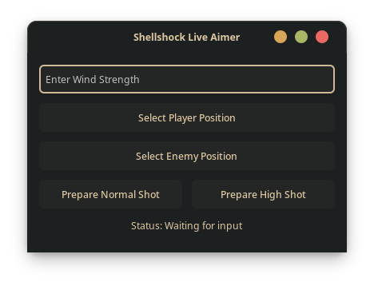

# Shellshock Live Aimbot
A Python-based aiming assistant for Shellshock Live that calculates optimal shot angles and power enabling a safe hit (most of the time).

## Features
- Calculates both normal and high-arcing shot trajectories
- Accounts for wind conditions
- Simple GTK-based GUI or CLI
- Linux-Only (except if you manually install GTK which i wont help you with!)


## Requirements
- Python 3.6+
- GTK 3.0
- PyGObject
- pynput


## Installation 
1. Clone Repository
```
git clone https://github.com/gmBlahaj/shellshock-live-aimbot.git
cd shellshock-live-aimbot
```
2. Install dependencies
```
pip install -r requirements.txt
```


## Usage
Run the GUI version:
```
python shellshock-gui.py
```
Or the CLI version
```
python shellshock-cli.py
```

### CLI Version:
1. ```Ctrl+Alt+P```: Select Player
2. ```Ctrl+Alt+E```: Select Enemy
3. ```Ctrl+Alt+W```: Enter Wind strength (if applicable)
4. ```Ctrl+Alt+S```: Calculate Normal Shots
5. ```Ctrl+Alt+H```: Calculate High Shots
6. Adjust your Firing-Angle and Velocity
7. Fire

### GUI Version:
1. Click "Select Player Position" and click on your tank
2. Click "Select Enemy Position" and click on the enemy tank
3. Enter wind strength if applicable
4. Click "Prepare Normal Shot" or "Prepare High Shot" to calculate angle and power
5. The Application will automatically adjust the angle
6. Click Fire


## Tips:
Some tips to better your chances of hitting:
- Ensure you are on a flat surface (if not possible, try High Shot for better chances)
- Enemies in Holes will be pretty much only be able to be targeted with the High Shot
## Notes
- This script is not a 100% hit guarantee, there are certain weapons like "Glock" or "Ring" that have different shooting mechanics (Will be worked on), or other conditions like enemy positioning
- It also does not take into account obstacles like portals, black holes or barriers
- High-Shot seems to be off by 1-2% due to unknown circumstances
- A Windows Version will maybe be released in the future

## Credits
This project is based on the original work by [HenryDatei with ShellShockLiveAimbot](https://github.com/henrydatei/ShellShockLiveAimbot).

## Disclaimer
This tool is intended for educational purposes only. Use at your own discretion in accordance with Shellshock Live's terms of service.

## Screenshots
### GUI:

### CLI:

### Footage:


